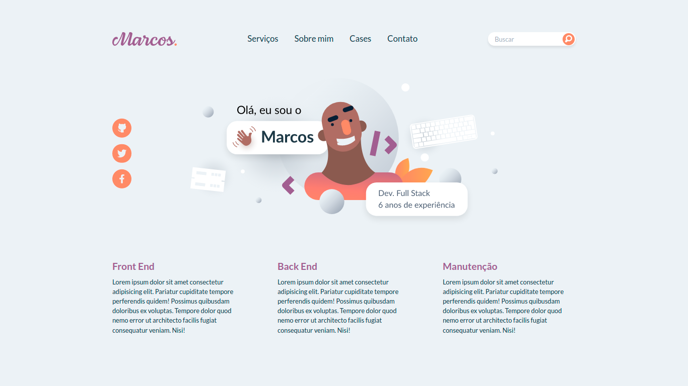

<h1 align="center">Portifólio com Vue em Atomic Design</h1>
<p>Curso criado com objetivo de aprender a metodologia de componentização e organização, Atomic Design</p>
<h1 align="center">
  
</h1>

### Pré-requisitos

Antes de começar, você vai precisar ter instalado em sua máquina as seguintes ferramentas:
[Git](https://git-scm.com), [Node.js](https://nodejs.org/en/). 
Além disto é bom ter um editor para trabalhar com o código como [VSCode](https://code.visualstudio.com/)

### 🎲 Rodando o App
```bash
# Clone este repositório
$ git clone <https://github.com/code-pisces/atomic-design-cataline-bootcamp>

# Acesse a pasta do projeto no terminal/cmd
$ cd atomic-design-cataline-bootcamp

# Instale as dependências
$ yarn

# Execute a aplicação em modo de desenvolvimento
$ yarn serve

# O servidor iniciará na porta:8080 - acesse <http://localhost:8080>
```

---
<p align="center">Desenvolvido por Gustavo Amorim</p>